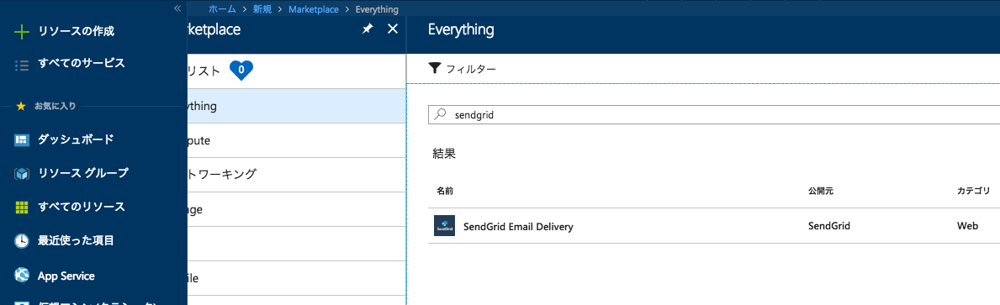
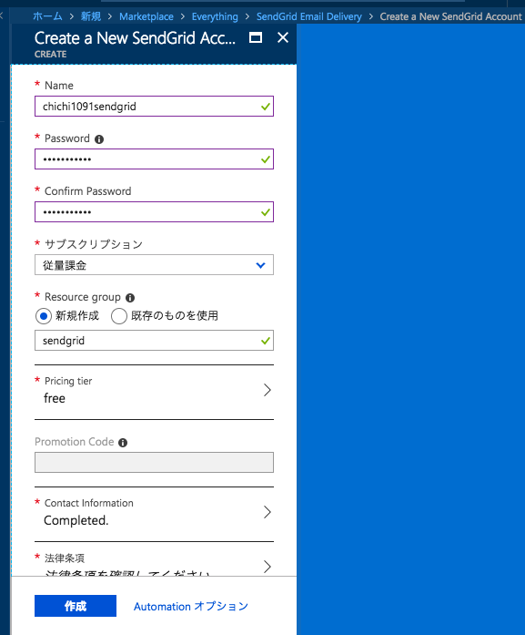
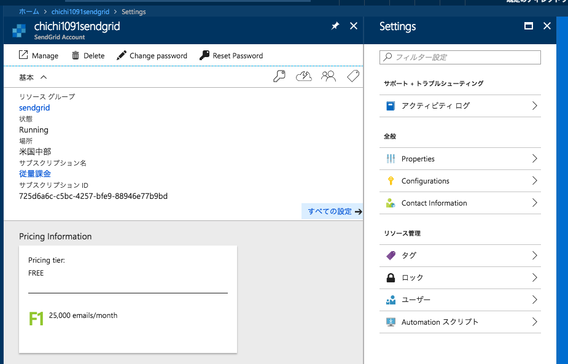
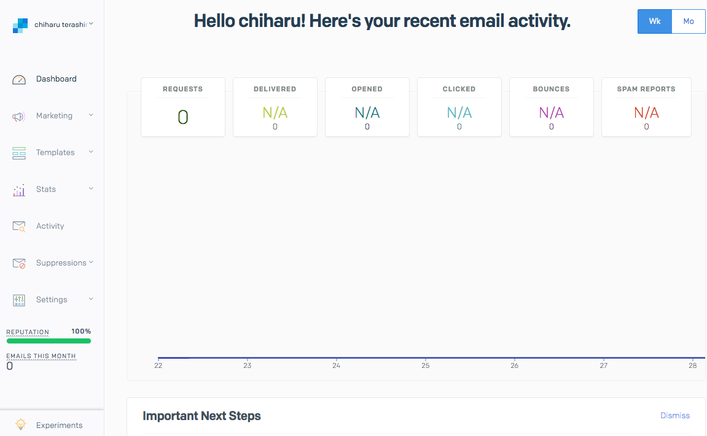
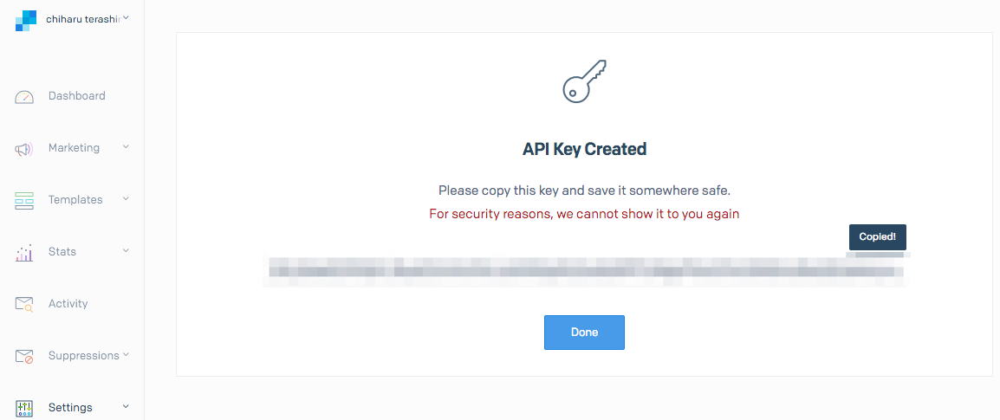

# PythonとSendGridで簡単メール送信
<p align="right">
@chichi1091<br/>
2018.xx.xx<br/>
xxxxxxxxxxxxxx
</p>

---
## 自己紹介


* 寺嶋 千晴 (てらしま ちはる)
* [てっしー/chichi1091](https://twitter.com/chichi1091)
* 長野市内のちっちゃいSIerに勤務
* Java、PHP、Python

---
## SendGridって？


* クラウドベイルのメール配信サービス
* 独自にサーバを運用する必要がなく、大量のメールを高速かつ確実に届けられる
* SMTP以外にもWebAPI経由で送信することも可能
* 12,000通／月なら無料プランがある

---
## Azure経由での契約がお得

Azureのマーケットプレイス経由でSendGridを登録するとFreeプランの制限が12,000通／月から25,000通／月になりお得になるためオススメ！

---
## 環境構築（SendGrid マーケットプレイス）

* Azureポータルから「リソースの作成」で「SendGrid」と入力し「SendGrid Email Delivery」を選択



---
## 環境構築（SendGrid マーケットプレイス）

* 「作成」ボタンを押して「Create a New SendGrid Account」を入力  
* 「作成」ボタンを押してしばらく(数分)待つとデプロイ完了 



---
## 環境構築（SendGrid マーケットプレイス）



* 「Configurations」をクリックでSMTPのユーザと接続先を確認することができる

---
## 環境構築（SendGrid APIキー）

* 「Manage」をクリックしてSendGridダッシュボードへ
* 「Settings->API Keys」でキーを作成



---
## 環境構築（SendGrid APIキー）

* 「Create API Key」でキーを作成



---
## 環境構築（Python）

```bash
$ pip install sendgrid
```

---?code=sendgrid.py
## 配信

* SendGridモジュールを使えば簡単にAPI経由のメール送信ができる！

---
## まとめ
* Azure経由でSendGridを利用するのがお得
* ポチポチするだけで簡単環境構築
* 大量メール送信に特化しているので何も気にせずバンバン送れる

---
## おしまい
ご清聴ありがとうございました
